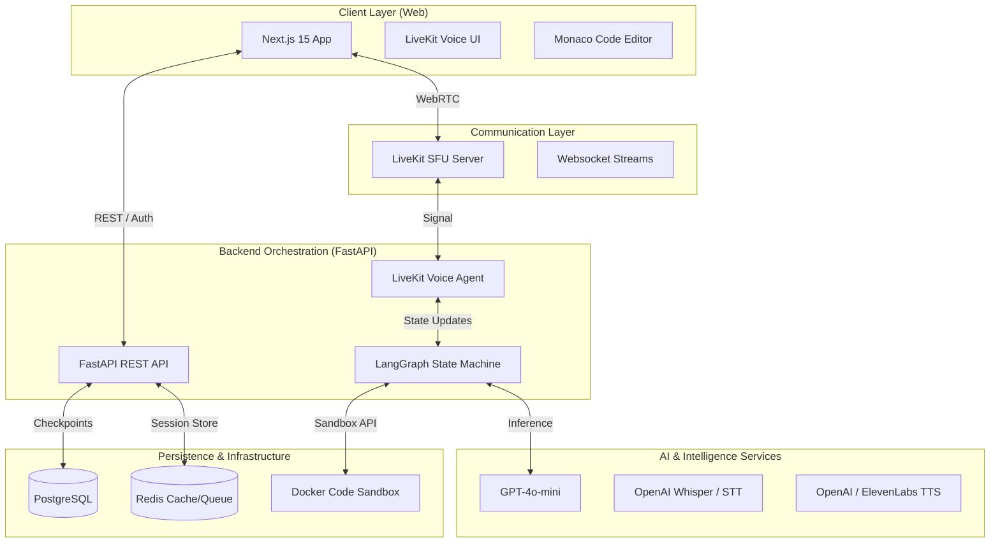
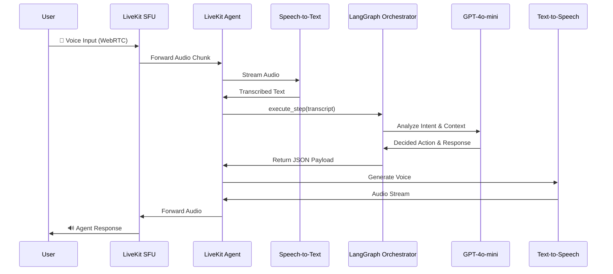
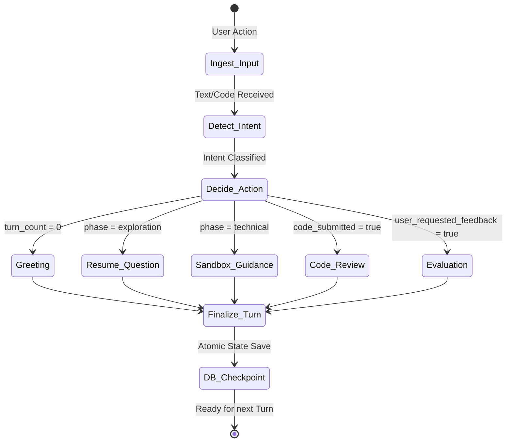

# 🎙️ InterviewLab: The Next-Gen AI Technical Interview Platform

<div align="center">
  
  <br/><br/>
  
  [](https://www.gnu.org/licenses/gpl-3.0)
  [](https://nextjs.org/)
  [](https://fastapi.tiangolo.com/)
  [](https://www.langchain.com/langgraph)
  [](https://livekit.io/)
  <br/>
  **Revolutionizing technical interviews through real-time voice AI, live sandboxed coding, and deep-learning-based evaluation.**
</div>

---

## 🌟 Overview

**InterviewLab** is a full-stack, production-ready platform designed to simulate realistic technical interviews. It bridges the gap between static practice and actual human interviews by providing a highly interactive, voice-first experience paired with a live coding environment.

### 🚀 Key Value Propositions
- **Dynamic Realism:** Move beyond "LeetCode grinding" with an interviewer that probes your reasoning, not just your syntax.
- **Instantaneous Feedback:** Receive detailed performance analytics across communication, problem-solving, and code quality.
- **Resume-Aware Interrogation:** The AI tailors its questions based on your specific background and claimed expertise.
- **Ultra-Low Latency:** Experience seamless voice interactions (<2s response time) using optimized WebRTC pipelines.

---

## 🏗️ System Architecture

InterviewLab leverages a modern, distributed architecture designed for scalability and real-time performance.



### 🧩 Core Component Roles

| Component | Technology | Description |
| :--- | :--- | :--- |
| **Logic Engine** | LangGraph | Deterministic state-machine that manages the interview lifecycle and branching logic. |
| **Voice Bridge** | LiveKit SDK | Handles real-time WebRTC audio streams with jitter buffers and noise suppression. |
| **Sandbox** | Docker | Executes untrusted candidate code in isolated, ephemeral Linux containers. |
| **State Store** | PostgreSQL | Persists interview transcripts, code changes, and evaluation metrics using Alembic migrations. |

---

## 🔄 Data Flows & Lifecycle

### 1. Voice Interaction Pipeline
The life of an audio signal from user voice to AI response.



### 2. Interview State Management (LangGraph)
How the "AI brain" decides what happens next based on the conversation history.



---

## 💻 Technical Implementation

### Backend Strategy
- **Asynchronous Processing:** Built on `FastAPI` and `asyncio` to handle concurrent voice streams and long-running LLM inferences without blocking.
- **Structured Outputs:** Uses Pydantic and the `Instructor` library to ensure LLM responses follow strict JSON schemas for the orchestrator.
- **Secure Sandboxing:** Dedicated service that spins up temporary Docker containers to execute Python/JS code, protecting the host system.

### Frontend Excellence
- **Real-time Synchronization:** Uses `Zustand` for global state management, ensuring the voice transcript and code editor are always in sync.
- **Dynamic Visuals:** `Framer Motion` and `Lucide React` provide a premium, interactive interface with subtle micro-animations.
- **Performance:** Optimized for speed with Next.js Server Components and client-side caching via `TanStack Query`.

---

## 📁 Project Structure

```text
InterviewLab/
├── alembic/               # Database migration scripts
├── docs/                  # In-depth technical guides & architecture specs
├── frontend/              # Next.js Application
│   ├── app/               # App Router (pages & layouts)
│   ├── components/        # Redundant UI components & complex Interview kit
│   ├── hooks/             # Custom React hooks (LiveKit, Vapi, Auth)
│   └── lib/               # Utility functions & API clients
├── src/                   # Backend Application (Python)
│   ├── agents/            # LiveKit Agent implementation (STT/TTS bridge)
│   ├── api/               # FastAPI endpoints & routers
│   ├── core/              # Security, settings, and database config
│   ├── models/            # SQLAlchemy Database models
│   ├── schemas/           # Pydantic schemas (DToS)
│   └── services/          # Business Logic
│       ├── analysis/      # Performance & Code analysis services
│       ├── execution/     # Docker Sandbox orchestration
│       └── orchestrator/  # LangGraph Logic & Node definitions
├── docker-compose.yml     # Local infrastructure (DB, Redis, Sandbox)
├── Dockerfile             # Containerization for production
└── pyproject.toml         # Backend dependency management
```

---

## 🛠️ Setup & Development

### Prerequisites
- **Python 3.11+**
- **Node.js 20+**
- **Docker & Docker Compose**
- **Cloud API Keys:** OpenAI, LiveKit (or self-hosted), and Database credentials.

### Installation

1. **Clone the repository:**
   ```bash
   git clone https://github.com/your-username/InterviewLab.git
   cd InterviewLab
   ```

2. **Backend Setup:**
   ```bash
   pip install -e .
   cd src
   cp .env.example .env # Fill in your API keys
   uvicorn main:app --reload
   ```

3. **Frontend Setup:**
   ```bash
   cd frontend
   npm install
   npm run dev
   ```

4. **LiveKit Agent:**
   ```bash
   python -m src.agents.interview_agent
   ```

---

## 📚 Deep Dive Documentation

- 📐 **[System Architecture](docs/ARCHITECTURE.md)** - Deep dive into design patterns and communication protocols.
- 🧠 **[LangGraph Orchestration](docs/LANGGRAPH.md)** - Understanding the state machine and node logic.
- 🔊 **[Voice Infrastructure](docs/VOICE_INFRASTRUCTURE.md)** - LiveKit, WebRTC, and real-time processing.
- 📡 **[API Reference](docs/API.md)** - Complete REST API documentation.
- 🌍 **[Deployment Guide](docs/DEPLOYMENT.md)** - Production hosting on Railway and Vercel.

---

<div align="center">
  <p>Built with ❤️ by the InterviewLab Team</p>
  
  
</div>
